# Tài liệu SRS – Website X-Tech (Học tập trực tuyến)

> Tài liệu bổ sung cho Checklist đáp ứng SRS, bao gồm: Sơ đồ BPMN, Bảng yêu cầu chức năng & phi chức năng, Sơ đồ Use Case + đặc tả, Sơ đồ CSDL, Kiến trúc UML (MVC).

---

## Mục lục

1. [1.1 – Sơ đồ BPMN quy trình nghiệp vụ](#11--sơ-đồ-bpmn-quy-trình-nghiệp-vụ)
2. [1.2 – Bảng yêu cầu chức năng & phi chức năng](#12--bảng-yêu-cầu-chức-năng--phi-chức-năng)
3. [1.3 – Sơ đồ Use Case tổng quát + đặc tả](#13--sơ-đồ-use-case-tổng-quát--đặc-tả)
4. [2.1 – Sơ đồ CSDL MongoDB](#21--sơ-đồ-csdl-mongodb)
5. [2.2 – Bản thiết kế kiến trúc UML (MVC)](#22--bản-thiết-kế-kiến-trúc-uml-mvc)

---

## 1.1 – Sơ đồ BPMN quy trình nghiệp vụ

### 1.1.1 Quy trình Đăng ký & Đăng nhập

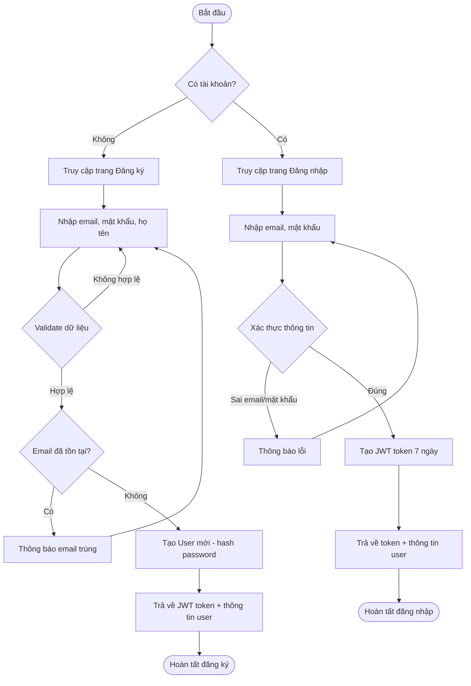

**Mô tả chi tiết:**
- Người dùng mới nhập `email`, `password`, `name` → Server validate → Kiểm tra trùng email → Hash password bằng bcrypt (salt=10) → Lưu User vào MongoDB → Trả JWT token (hạn 7 ngày).
- Người dùng cũ nhập `email`, `password` → Server tìm user theo email → So khớp password bằng `bcrypt.compare` → Trả JWT token.
- Token được lưu ở localStorage (frontend) và gửi qua header `Authorization: Bearer <token>` cho mỗi request tiếp theo.

---

### 1.1.2 Quy trình Quản lý khóa học (Giảng viên)

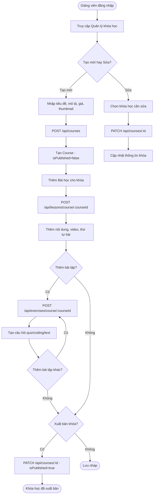

**Mô tả chi tiết:**
- Giảng viên (role=`instructor`) tạo khóa học mới → Mặc định `isPublished=false`.
- Thêm bài học (`Lesson`) với thứ tự (`order`), nội dung HTML/markdown, link video, thời lượng.
- Thêm bài tập (`Exercise`) với loại quiz/coding/text, danh sách câu hỏi, deadline.
- Khi sẵn sàng, giảng viên chuyển `isPublished=true` để học viên thấy khóa.
- Admin cũng có thể quản lý/sửa/xóa bất kỳ khóa nào.

---

### 1.1.3 Quy trình Đăng ký & Học khóa học (Học viên)

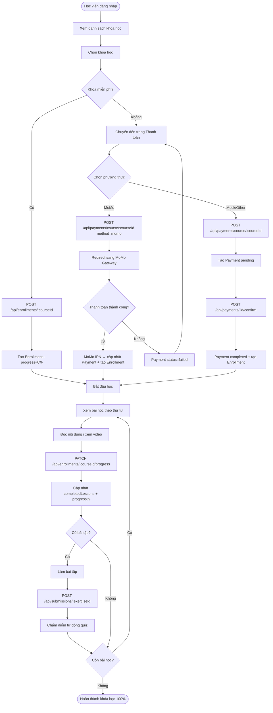

**Mô tả chi tiết:**
- Học viên xem danh sách khóa đã xuất bản → Chọn khóa → Nếu `price=0` đăng ký ngay, nếu `price>0` phải thanh toán trước.
- Thanh toán qua MoMo: gọi API tạo payment → redirect sang MoMo → IPN callback xác nhận → tự động tạo enrollment.
- Thanh toán mock: tạo payment pending → confirm → tạo enrollment.
- Học viên học từng bài → Hoàn thành bài → Cập nhật `completedLessons` + `progress%`.
- Làm bài tập quiz: tự động chấm điểm (so sánh `answers` với `correctAnswer`). Có thể nộp lại (update submission).

---

### 1.1.4 Quy trình Thanh toán

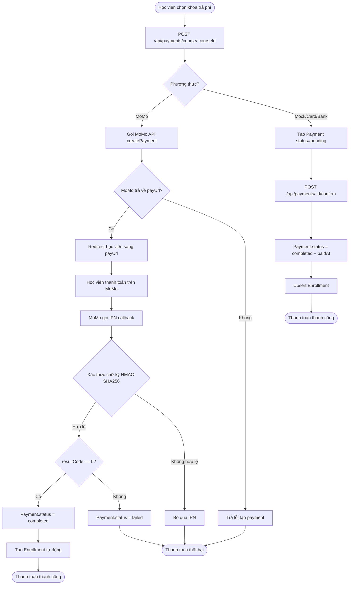

**Mô tả chi tiết:**
- Hệ thống hỗ trợ 5 phương thức thanh toán: `card`, `momo`, `bank`, `cod`, `mock`.
- MoMo: sử dụng API captureWallet v2, ký bằng HMAC-SHA256, xác thực IPN callback.
- Các phương thức khác: mô phỏng (tạo pending → confirm).
- Sau khi thanh toán thành công: tự động upsert enrollment cho học viên.
- Admin xem được tất cả giao dịch, lọc theo trạng thái.

---

### 1.1.5 Quy trình Cộng đồng (Bài viết & Bình luận)

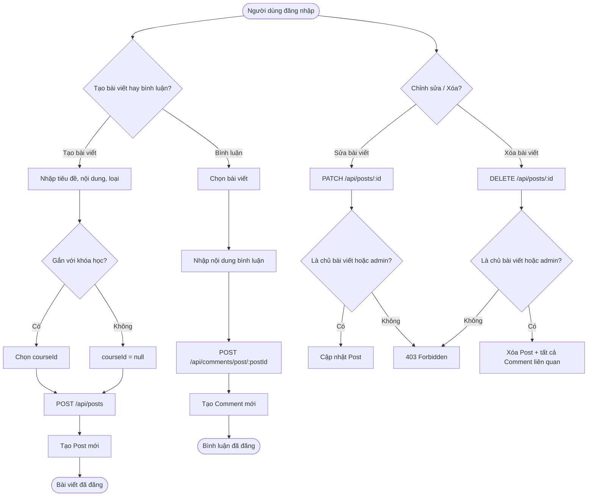

**Mô tả chi tiết:**
- Người dùng đã đăng nhập có thể tạo bài viết (type: `question` hoặc `share`), có thể gắn với khóa học.
- Mọi người có thể bình luận trên bài viết.
- Chỉ chủ bài viết hoặc admin có quyền sửa/xóa.
- Xóa bài viết sẽ cascade xóa tất cả bình luận của bài.

---

### 1.1.6 Quy trình Chatbot hỗ trợ học tập

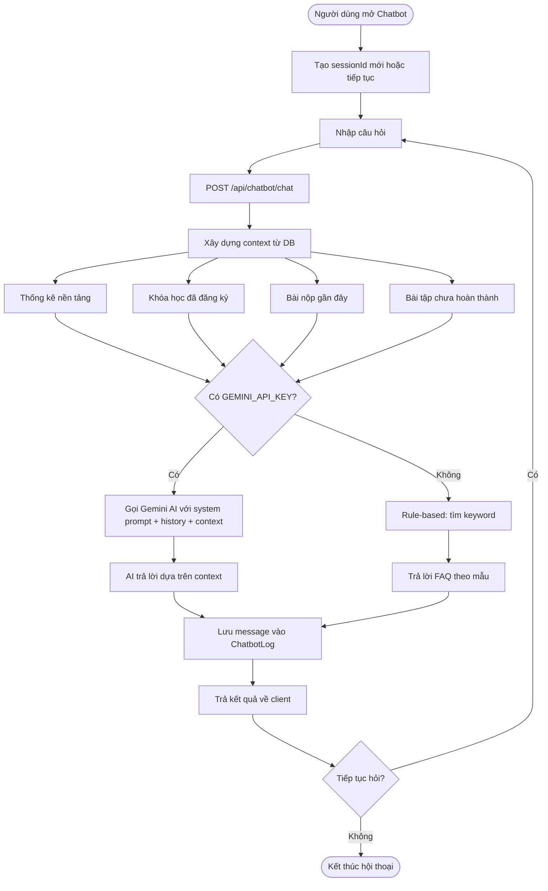

**Mô tả chi tiết:**
- Chatbot hỗ trợ học tập sử dụng Gemini AI (Google) hoặc fallback rule-based.
- System prompt bao gồm: vai trò trợ lý học tập X-Tech, thống kê nền tảng, thông tin học viên (khóa đăng ký, tiến độ, điểm bài tập).
- Lịch sử hội thoại được lưu theo `sessionId` trong collection `chatbot_logs`.
- API: `POST /api/chatbot/chat` (body: `{ message, sessionId }`) → `{ reply, sessionId }`.

---

## 1.2 – Bảng yêu cầu chức năng & phi chức năng

### 1.2.1 Yêu cầu chức năng (Functional Requirements)

| Mã | Nhóm UC | Yêu cầu | Vai trò | API | Trạng thái |
|----|---------|---------|---------|-----|-----------|
| **FR-01** | UC1 | Đăng ký tài khoản (email, mật khẩu, họ tên) | Tất cả | `POST /api/auth/register` | ✅ Đã triển khai |
| **FR-02** | UC1 | Đăng nhập bằng email & mật khẩu, nhận JWT token | Tất cả | `POST /api/auth/login` | ✅ Đã triển khai |
| **FR-03** | UC1 | Xem thông tin cá nhân (profile) | Tất cả | `GET /api/auth/me` | ✅ Đã triển khai |
| **FR-04** | UC1 | Cập nhật hồ sơ (tên, avatar) | Tất cả | `PATCH /api/users/profile` | ✅ Đã triển khai |
| **FR-05** | UC1 | Đổi mật khẩu (cần xác nhận mật khẩu cũ) | Tất cả | `POST /api/users/change-password` | ✅ Đã triển khai |
| **FR-06** | UC1 | Admin: Xem danh sách user (phân trang, lọc role, tìm kiếm) | Admin | `GET /api/users` | ✅ Đã triển khai |
| **FR-07** | UC1 | Admin: Xem chi tiết / Cập nhật / Xóa user | Admin | `GET/PATCH/DELETE /api/users/:id` | ✅ Đã triển khai |
| **FR-08** | UC1 | Admin: Phân quyền (admin, instructor, student) | Admin | `PATCH /api/users/:id` (field role) | ✅ Đã triển khai |
| **FR-09** | UC2 | Xem danh sách khóa học (phân trang, tìm kiếm, lọc giá, sắp xếp) | Tất cả | `GET /api/courses` | ✅ Đã triển khai |
| **FR-10** | UC2 | Xem chi tiết khóa học | Tất cả | `GET /api/courses/:id` | ✅ Đã triển khai |
| **FR-11** | UC2 | Tạo khóa học mới | Instructor/Admin | `POST /api/courses` | ✅ Đã triển khai |
| **FR-12** | UC2 | Sửa thông tin khóa học (tiêu đề, mô tả, giá, thumbnail, xuất bản) | Instructor/Admin | `PATCH /api/courses/:id` | ✅ Đã triển khai |
| **FR-13** | UC2 | Xóa khóa học (cascade xóa bài học, bài tập) | Instructor/Admin | `DELETE /api/courses/:id` | ✅ Đã triển khai |
| **FR-14** | UC2 | Xem khóa học của mình (instructor: tạo, student: đăng ký) | Instructor/Student | `GET /api/courses/my` | ✅ Đã triển khai |
| **FR-15** | UC2 | Đăng ký khóa học miễn phí | Student | `POST /api/enrollments/:courseId` | ✅ Đã triển khai |
| **FR-16** | UC3 | Xem danh sách bài học theo khóa (sắp xếp theo order) | Tất cả | `GET /api/lessons/course/:courseId` | ✅ Đã triển khai |
| **FR-17** | UC3 | Xem chi tiết bài học (nội dung, video) | Tất cả | `GET /api/lessons/:id` | ✅ Đã triển khai |
| **FR-18** | UC3 | Thêm/Sửa/Xóa bài học | Instructor/Admin | `POST/PATCH/DELETE /api/lessons/*` | ✅ Đã triển khai |
| **FR-19** | UC3 | Xem danh sách bài tập theo khóa | Tất cả | `GET /api/exercises/course/:courseId` | ✅ Đã triển khai |
| **FR-20** | UC3 | Xem chi tiết bài tập | Tất cả | `GET /api/exercises/:id` | ✅ Đã triển khai |
| **FR-21** | UC3 | Thêm/Sửa/Xóa bài tập (quiz, coding, text) | Instructor/Admin | `POST/PATCH/DELETE /api/exercises/*` | ✅ Đã triển khai |
| **FR-22** | UC3 | Nộp bài tập (hỗ trợ nộp lại) | Student | `POST /api/submissions/:exerciseId` | ✅ Đã triển khai |
| **FR-23** | UC3 | Chấm điểm tự động bài quiz | Hệ thống | Tự động trong submission | ✅ Đã triển khai |
| **FR-24** | UC3 | Xem bài nộp cá nhân / tất cả (giảng viên) | Student/Instructor | `GET /api/submissions/*` | ✅ Đã triển khai |
| **FR-25** | UC3 | Cập nhật tiến độ học (completedLessons, progress%) | Student | `PATCH /api/enrollments/:courseId/progress` | ✅ Đã triển khai |
| **FR-26** | UC4 | Tạo thanh toán cho khóa học | Student | `POST /api/payments/course/:courseId` | ✅ Đã triển khai |
| **FR-27** | UC4 | Thanh toán qua MoMo (redirect, IPN callback) | Student | MoMo Gateway + IPN | ✅ Đã triển khai |
| **FR-28** | UC4 | Xác nhận thanh toán (mock) + tự động tạo enrollment | Student | `POST /api/payments/:id/confirm` | ✅ Đã triển khai |
| **FR-29** | UC4 | Xem lịch sử thanh toán cá nhân | Student | `GET /api/payments` | ✅ Đã triển khai |
| **FR-30** | UC4 | Admin: Xem tất cả giao dịch (lọc status, phân trang) | Admin | `GET /api/payments/admin` | ✅ Đã triển khai |
| **FR-31** | UC5 | Xem danh sách bài viết (lọc theo khóa, loại, tìm kiếm) | Tất cả | `GET /api/posts` | ✅ Đã triển khai |
| **FR-32** | UC5 | Xem chi tiết bài viết + bình luận | Tất cả | `GET /api/posts/:id` | ✅ Đã triển khai |
| **FR-33** | UC5 | Tạo / Sửa / Xóa bài viết | Tất cả (đăng nhập) | `POST/PATCH/DELETE /api/posts/*` | ✅ Đã triển khai |
| **FR-34** | UC5 | Tạo / Sửa / Xóa bình luận | Tất cả (đăng nhập) | `POST/PATCH/DELETE /api/comments/*` | ✅ Đã triển khai |
| **FR-35** | Chatbot | Chat với chatbot AI (Gemini hoặc rule-based) | Tất cả | `POST /api/chatbot/chat` | ✅ Đã triển khai |
| **FR-36** | Chatbot | Xem lịch sử hội thoại | Tất cả | `GET /api/chatbot/history/:sessionId` | ✅ Đã triển khai |
| **FR-37** | Admin | Xem thống kê tổng quan (users, courses, payments, revenue) | Admin | `GET /api/admin/stats` | ✅ Đã triển khai |
| **FR-38** | Admin | Xem biểu đồ phân tích (30 ngày, phân bố role, top khóa) | Admin | `GET /api/admin/charts` | ✅ Đã triển khai |
| **FR-39** | Upload | Upload thumbnail khóa học | Instructor/Admin | `POST /api/upload/thumbnail` | ✅ Đã triển khai |

---

### 1.2.2 Yêu cầu phi chức năng (Non-Functional Requirements)

| Mã | Nhóm | Yêu cầu | Chi tiết triển khai |
|----|-------|---------|-------------------|
| **NFR-01** | Bảo mật | Mật khẩu phải được mã hóa, không lưu plain text | bcrypt hash (salt round = 10) |
| **NFR-02** | Bảo mật | Xác thực bằng JWT, hết hạn sau thời gian quy định | JWT Bearer token, TTL = 7 ngày |
| **NFR-03** | Bảo mật | Phân quyền truy cập theo vai trò (RBAC) | Middleware `requireRole('admin')`, `requireRole('instructor', 'admin')` |
| **NFR-04** | Bảo mật | Mật khẩu không được trả về trong response | Mongoose `select: false` trên field password |
| **NFR-05** | Bảo mật | Xác thực chữ ký thanh toán MoMo | HMAC-SHA256 signature verification |
| **NFR-06** | Hiệu suất | Hỗ trợ phân trang cho danh sách (page, limit) | Có trên users, courses, payments, posts, submissions |
| **NFR-07** | Hiệu suất | Đánh index MongoDB cho các trường truy vấn phổ biến | Index trên courseId, userId, lessonId, status, sessionId, v.v. |
| **NFR-08** | Hiệu suất | Tìm kiếm full-text bằng regex | Hỗ trợ search trên name/email (users), title/description (courses), title/content (posts) |
| **NFR-09** | Tính sẵn sàng | Database MongoDB Atlas (cloud) | Kết nối qua `MONGODB_URI` env variable |
| **NFR-10** | Tính sẵn sàng | CORS cho phép cross-origin | Express CORS middleware, cho phép tất cả origins |
| **NFR-11** | Tính mở rộng | Kiến trúc MVC tách biệt (Model - Controller - Route) | Models (10), Controllers (12), Routes (13) tách riêng |
| **NFR-12** | Tính mở rộng | Hỗ trợ nhiều phương thức thanh toán | Kiến trúc hỗ trợ card, momo, bank, cod, mock |
| **NFR-13** | Tính mở rộng | Chatbot hỗ trợ cả AI và rule-based (fallback) | Gemini AI + keyword-based fallback |
| **NFR-14** | Khả dụng | Trang web responsive, hỗ trợ mobile/tablet | Tailwind CSS responsive design |
| **NFR-15** | Khả dụng | Giao diện quản trị riêng cho Admin | Route group `/admin/*` với layout riêng |
| **NFR-16** | Dữ liệu | Seed data thử nghiệm đầy đủ | Script seed: 100 users, 30 courses, 50+ lessons/exercises |
| **NFR-17** | Logging | Ghi log HTTP request | Morgan middleware (dev mode) |
| **NFR-18** | Upload | Hỗ trợ upload file ảnh | Multer middleware, lưu vào `/uploads`, phục vụ static |

---

## 1.3 – Sơ đồ Use Case tổng quát + đặc tả

### 1.3.1 Sơ đồ Use Case tổng quát

```mermaid
graph LR
    Admin((Admin))
    Instructor((Giảng viên))
    Student((Học viên))
    Guest((Khách))

    subgraph UC1[UC1: Quản lý người dùng]
        UC1_1[Đăng ký]
        UC1_2[Đăng nhập]
        UC1_3[Xem/Sửa hồ sơ]
        UC1_4[Đổi mật khẩu]
        UC1_5[CRUD User - Admin]
        UC1_6[Phân quyền - Admin]
    end

    subgraph UC2[UC2: Quản lý khóa học]
        UC2_1[Xem danh sách khóa]
        UC2_2[Xem chi tiết khóa]
        UC2_3[Tạo khóa học]
        UC2_4[Sửa khóa học]
        UC2_5[Xóa khóa học]
        UC2_6[Xuất bản khóa học]
        UC2_7[Đăng ký khóa miễn phí]
    end

    subgraph UC3[UC3: Quản lý bài học & bài tập]
        UC3_1[Xem bài học]
        UC3_2[Thêm/Sửa/Xóa bài học]
        UC3_3[Xem bài tập]
        UC3_4[Thêm/Sửa/Xóa bài tập]
        UC3_5[Nộp bài tập]
        UC3_6[Chấm điểm tự động]
        UC3_7[Theo dõi tiến độ]
    end

    subgraph UC4[UC4: Quản lý thanh toán]
        UC4_1[Thanh toán khóa học]
        UC4_2[Thanh toán MoMo]
        UC4_3[Xem lịch sử thanh toán]
        UC4_4[Quản lý giao dịch - Admin]
    end

    subgraph UC5[UC5: Quản lý cộng đồng]
        UC5_1[Xem bài viết]
        UC5_2[Tạo bài viết]
        UC5_3[Bình luận]
        UC5_4[Sửa/Xóa bài viết]
        UC5_5[Quản lý nội dung - Admin]
    end

    subgraph UC6[Chatbot]
        UC6_1[Chat hỏi đáp AI]
        UC6_2[Xem lịch sử chat]
    end

    Guest --> UC1_1 & UC1_2 & UC2_1 & UC2_2
    Student --> UC1_3 & UC1_4 & UC2_7 & UC3_1 & UC3_3 & UC3_5 & UC3_7 & UC4_1 & UC4_2 & UC4_3 & UC5_1 & UC5_2 & UC5_3 & UC6_1 & UC6_2
    Instructor --> UC1_3 & UC1_4 & UC2_3 & UC2_4 & UC2_5 & UC2_6 & UC3_2 & UC3_4 & UC3_6 & UC5_1 & UC5_2 & UC5_3 & UC6_1
    Admin --> UC1_5 & UC1_6 & UC2_5 & UC4_4 & UC5_5
```

---

### 1.3.2 Đặc tả Use Case chi tiết

#### UC1: Quản lý thông tin người dùng

| Thuộc tính | Chi tiết |
|-----------|---------|
| **Tên UC** | UC1 – Quản lý thông tin người dùng |
| **Tác nhân** | Khách, Học viên, Giảng viên, Admin |
| **Mô tả** | Cho phép đăng ký, đăng nhập, quản lý hồ sơ cá nhân, và quản trị viên quản lý danh sách user |
| **Tiền điều kiện** | – Đăng ký/Đăng nhập: không cần đăng nhập – Hồ sơ/Đổi MK: đã đăng nhập – CRUD User: đã đăng nhập với role admin |
| **Luồng chính** | 1. Khách truy cập trang đăng ký → Nhập email, mật khẩu (≥6 ký tự), họ tên → Submit 2. Hệ thống validate → Kiểm tra trùng email → Hash password → Tạo User (role=student mặc định) → Trả JWT 3. Đăng nhập: Nhập email + mật khẩu → Xác thực → Trả JWT 4. Xem hồ sơ: Gọi API `/api/auth/me` với Bearer token 5. Sửa hồ sơ: PATCH name/avatar 6. Đổi mật khẩu: Nhập mật khẩu cũ + mới → Xác thực MK cũ → Hash MK mới |
| **Luồng phụ** | Admin: Xem danh sách user (phân trang, lọc) → Sửa role → Xóa user |
| **Hậu điều kiện** | User được tạo/cập nhật trong DB. JWT hợp lệ để truy cập API khác |
| **Ngoại lệ** | Email trùng → 400; Sai MK → 401; Không có quyền → 403 |

---

#### UC2: Quản lý khóa học

| Thuộc tính | Chi tiết |
|-----------|---------|
| **Tên UC** | UC2 – Quản lý khóa học |
| **Tác nhân** | Khách (xem), Instructor (CRUD), Student (đăng ký, xem), Admin (quản lý) |
| **Mô tả** | Tạo, sửa, xóa, xuất bản khóa học; học viên xem và đăng ký |
| **Tiền điều kiện** | – Xem danh sách: không cần đăng nhập – Tạo/Sửa: role = instructor hoặc admin – Đăng ký: role = student, đã đăng nhập |
| **Luồng chính** | 1. Giảng viên tạo khóa: Nhập title, description, price, thumbnail → `POST /api/courses` 2. Khóa mới có `isPublished=false` (nháp) 3. GV thêm bài học, bài tập cho khóa 4. GV chuyển `isPublished=true` để xuất bản 5. Học viên duyệt danh sách khóa đã xuất bản → Xem chi tiết 6. Đăng ký khóa miễn phí: `POST /api/enrollments/:courseId` 7. Khóa trả phí: thanh toán trước (→ UC4) |
| **Luồng phụ** | Admin xem/sửa/xóa bất kỳ khóa. Xóa khóa cascade: xóa lessons, exercises, nullify posts.courseId |
| **Hậu điều kiện** | Course được tạo/cập nhật trong DB. Enrollment được tạo cho học viên |
| **Ngoại lệ** | Khóa chưa xuất bản chỉ hiển thị cho owner/admin. Đăng ký trùng → thông báo đã đăng ký |

---

#### UC3: Quản lý bài học & bài tập

| Thuộc tính | Chi tiết |
|-----------|---------|
| **Tên UC** | UC3 – Quản lý bài học & bài tập |
| **Tác nhân** | Instructor (CRUD), Student (xem, làm bài, nộp bài), Admin |
| **Mô tả** | Thêm/sửa bài học; thêm/sửa bài tập (quiz/coding/text); học viên làm và nộp bài; chấm điểm tự động; theo dõi tiến độ |
| **Tiền điều kiện** | – Phải có khóa học (Course) tồn tại – CRUD: Instructor sở hữu khóa hoặc Admin – Nộp bài: Student đã đăng ký khóa |
| **Luồng chính** | 1. GV thêm bài học: title, content (HTML/markdown), videoUrl, order, duration → `POST /api/lessons/course/:courseId` 2. GV thêm bài tập: title, type (quiz/coding/text), questions[], deadline → `POST /api/exercises/course/:courseId` 3. Học viên xem bài học theo thứ tự → Đánh dấu hoàn thành → Cập nhật progress 4. Học viên làm bài quiz → Nộp answers[] → Hệ thống tự chấm (so sánh correctAnswer) → Trả score, percentage 5. GV xem tất cả bài nộp của khóa/bài tập |
| **Luồng phụ** | Nộp lại bài tập (update submission). Tiến độ tính theo: completedLessons.length / totalLessons × 100 |
| **Hậu điều kiện** | Lessons, Exercises lưu trong DB. Submissions lưu điểm. Enrollment.progress cập nhật |
| **Ngoại lệ** | Bài tập đã hết deadline (nếu có). GV không phải chủ khóa → 403 |

---

#### UC4: Quản lý thanh toán

| Thuộc tính | Chi tiết |
|-----------|---------|
| **Tên UC** | UC4 – Quản lý thanh toán |
| **Tác nhân** | Student (thanh toán), Admin (quản lý), Hệ thống MoMo (IPN) |
| **Mô tả** | Thanh toán khóa học qua MoMo hoặc mô phỏng; xem lịch sử; admin quản lý giao dịch |
| **Tiền điều kiện** | – Student đã đăng nhập – Khóa học đã xuất bản, có price > 0 – Cấu hình MOMO env vars (nếu dùng MoMo) |
| **Luồng chính** | 1. Student chọn khóa trả phí → `POST /api/payments/course/:courseId` với method 2. Nếu MoMo: gọi API MoMo captureWallet → redirect sang payUrl → MoMo callback IPN → xác thực signature → cập nhật status 3. Nếu mock: tạo payment pending → confirm → status=completed 4. Sau thanh toán thành công: tự động upsert Enrollment 5. Student xem lịch sử: `GET /api/payments` 6. Admin xem tất cả: `GET /api/payments/admin` (phân trang, lọc) |
| **Luồng phụ** | Thanh toán thất bại → status=failed. Có thể thử lại |
| **Hậu điều kiện** | Payment record lưu DB. Enrollment tự động tạo nếu thành công |
| **Ngoại lệ** | MoMo API lỗi → trả lỗi. Signature không hợp lệ → bỏ qua IPN. Số tiền ngoài phạm vi (1,000 – 50,000,000 VNĐ) |

---

#### UC5: Quản lý cộng đồng

| Thuộc tính | Chi tiết |
|-----------|---------|
| **Tên UC** | UC5 – Quản lý cộng đồng |
| **Tác nhân** | Tất cả (xem), Người dùng đăng nhập (tạo/sửa/xóa), Admin (quản lý) |
| **Mô tả** | Tạo bài viết (question/share), bình luận trên bài viết, gắn bài viết với khóa học |
| **Tiền điều kiện** | – Xem: không cần đăng nhập – Tạo/Sửa/Xóa: đã đăng nhập |
| **Luồng chính** | 1. Xem danh sách bài viết (lọc theo courseId, type, search, phân trang) 2. Tạo bài viết: title, content, type (question/share), courseId (optional) 3. Bình luận trên bài viết: `POST /api/comments/post/:postId` 4. Sửa bài viết/bình luận (chỉ chủ hoặc admin) 5. Xóa bài viết → cascade xóa tất cả comments |
| **Luồng phụ** | Admin can sửa/xóa bất kỳ bài viết/bình luận |
| **Hậu điều kiện** | Posts, Comments lưu trong DB |
| **Ngoại lệ** | Không phải chủ bài + không phải admin → 403 |

---

## 2.1 – Sơ đồ CSDL MongoDB

### 2.1.1 Sơ đồ quan hệ (Entity Relationship)

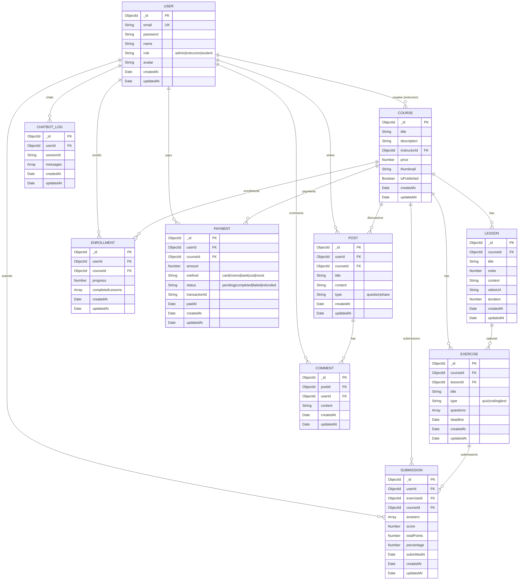

### 2.1.2 Chi tiết từng Collection

#### Collection: `users`

| Trường | Kiểu | Ràng buộc | Mô tả |
|--------|------|-----------|-------|
| `_id` | ObjectId | PK, auto | ID tự động |
| `email` | String | required, unique, lowercase | Email đăng nhập |
| `password` | String | required, minlength: 6, select: false | Mật khẩu đã hash (bcrypt) |
| `name` | String | required, minlength: 1 | Họ tên |
| `role` | String | enum: admin/instructor/student, default: student | Vai trò |
| `avatar` | String | nullable | URL ảnh đại diện |
| `createdAt` | Date | auto (timestamps) | Ngày tạo |
| `updatedAt` | Date | auto (timestamps) | Ngày cập nhật |

#### Collection: `courses`

| Trường | Kiểu | Ràng buộc | Mô tả |
|--------|------|-----------|-------|
| `_id` | ObjectId | PK | ID tự động |
| `title` | String | required | Tên khóa học |
| `description` | String | default: '' | Mô tả |
| `instructorId` | ObjectId | required, ref: User | Giảng viên tạo khóa |
| `price` | Number | default: 0, min: 0 | Giá (VNĐ), 0 = miễn phí |
| `thumbnail` | String | nullable | Ảnh đại diện khóa |
| `isPublished` | Boolean | default: false | Đã xuất bản? |
| **Index** | | `instructorId`, `isPublished` | |

#### Collection: `lessons`

| Trường | Kiểu | Ràng buộc | Mô tả |
|--------|------|-----------|-------|
| `_id` | ObjectId | PK | ID tự động |
| `courseId` | ObjectId | required, ref: Course | Thuộc khóa nào |
| `title` | String | required | Tiêu đề bài học |
| `order` | Number | default: 0, min: 0 | Thứ tự sắp xếp |
| `content` | String | default: '' | Nội dung HTML/Markdown |
| `videoUrl` | String | nullable | Link video bài giảng |
| `duration` | Number | default: 0, min: 0 | Thời lượng (phút) |
| **Index** | | `{ courseId, order }` | Compound index |

#### Collection: `exercises`

| Trường | Kiểu | Ràng buộc | Mô tả |
|--------|------|-----------|-------|
| `_id` | ObjectId | PK | ID tự động |
| `courseId` | ObjectId | required, ref: Course | Thuộc khóa nào |
| `lessonId` | ObjectId | nullable, ref: Lesson | Gắn với bài học (optional) |
| `title` | String | required | Tiêu đề bài tập |
| `type` | String | enum: quiz/coding/text, default: quiz | Loại bài tập |
| `questions` | Array | default: [] | Danh sách câu hỏi |
| `questions[].question` | String | | Nội dung câu hỏi |
| `questions[].options` | [String] | | Các lựa chọn (quiz) |
| `questions[].correctAnswer` | Mixed | | Đáp án đúng |
| `questions[].points` | Number | default: 1 | Điểm câu hỏi |
| `deadline` | Date | nullable | Hạn nộp bài |
| **Index** | | `courseId`, `lessonId` | |

#### Collection: `enrollments`

| Trường | Kiểu | Ràng buộc | Mô tả |
|--------|------|-----------|-------|
| `_id` | ObjectId | PK | ID tự động |
| `userId` | ObjectId | required, ref: User | Học viên |
| `courseId` | ObjectId | required, ref: Course | Khóa học |
| `progress` | Number | default: 0, min: 0, max: 100 | Tiến độ (%) |
| `completedLessons` | [ObjectId] | ref: Lesson | Danh sách bài đã hoàn thành |
| **Index** | | `{ userId, courseId }` unique | Mỗi user chỉ enroll 1 lần/khóa |

#### Collection: `payments`

| Trường | Kiểu | Ràng buộc | Mô tả |
|--------|------|-----------|-------|
| `_id` | ObjectId | PK | ID tự động |
| `userId` | ObjectId | required, ref: User | Người thanh toán |
| `courseId` | ObjectId | required, ref: Course | Khóa thanh toán |
| `amount` | Number | required, min: 0 | Số tiền (VNĐ) |
| `method` | String | enum: card/momo/bank/cod/mock | Phương thức |
| `status` | String | enum: pending/completed/failed/refunded | Trạng thái |
| `transactionId` | String | nullable | Mã giao dịch bên thứ 3 |
| `paidAt` | Date | nullable | Thời điểm thanh toán thành công |
| **Index** | | `userId`, `courseId`, `status` | |

#### Collection: `submissions`

| Trường | Kiểu | Ràng buộc | Mô tả |
|--------|------|-----------|-------|
| `_id` | ObjectId | PK | ID tự động |
| `userId` | ObjectId | required, ref: User | Học viên nộp bài |
| `exerciseId` | ObjectId | required, ref: Exercise | Bài tập |
| `courseId` | ObjectId | required, ref: Course | Khóa học |
| `answers` | Array | default: [] | Danh sách câu trả lời |
| `answers[].questionIndex` | Number | required | Index câu hỏi |
| `answers[].answer` | Mixed | | Câu trả lời |
| `score` | Number | default: 0, min: 0 | Điểm đạt được |
| `totalPoints` | Number | default: 0, min: 0 | Tổng điểm tối đa |
| `percentage` | Number | default: 0, 0-100 | Phần trăm |
| `submittedAt` | Date | default: Date.now | Thời điểm nộp |
| **Index** | | `{ userId, exerciseId }`, `{ userId, courseId }`, `exerciseId` | |

#### Collection: `posts`

| Trường | Kiểu | Ràng buộc | Mô tả |
|--------|------|-----------|-------|
| `_id` | ObjectId | PK | ID tự động |
| `userId` | ObjectId | required, ref: User | Tác giả |
| `courseId` | ObjectId | nullable, ref: Course | Gắn với khóa (optional) |
| `title` | String | required | Tiêu đề |
| `content` | String | required | Nội dung |
| `type` | String | enum: question/share | Loại bài viết |
| **Index** | | `userId`, `courseId`, `{ createdAt: -1 }` | |

#### Collection: `comments`

| Trường | Kiểu | Ràng buộc | Mô tả |
|--------|------|-----------|-------|
| `_id` | ObjectId | PK | ID tự động |
| `postId` | ObjectId | required, ref: Post | Thuộc bài viết nào |
| `userId` | ObjectId | required, ref: User | Người bình luận |
| `content` | String | required, minlength: 1 | Nội dung bình luận |
| **Index** | | `postId` | |

#### Collection: `chatbot_logs`

| Trường | Kiểu | Ràng buộc | Mô tả |
|--------|------|-----------|-------|
| `_id` | ObjectId | PK | ID tự động |
| `userId` | ObjectId | nullable, ref: User | Người dùng (null nếu chưa đăng nhập) |
| `sessionId` | String | required | ID phiên chat |
| `messages` | Array | | Lịch sử tin nhắn |
| `messages[].role` | String | enum: user/assistant | Vai trò (nguời dùng / bot) |
| `messages[].content` | String | | Nội dung tin nhắn |
| `messages[].createdAt` | Date | default: Date.now | Thời điểm |
| **Index** | | `sessionId`, `userId` | |

---

## 2.2 – Bản thiết kế kiến trúc UML (MVC)

### 2.2.1 Sơ đồ kiến trúc tổng quan

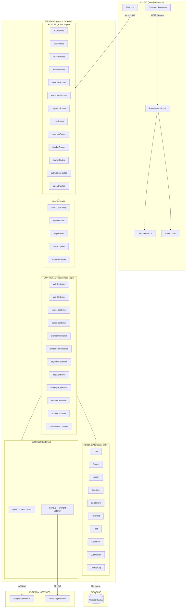

### 2.2.2 Sơ đồ MVC chi tiết

```mermaid
graph LR
    subgraph View["VIEW (Frontend - Next.js)"]
        direction TB
        V1["app/(auth)/ - Login, Register"]
        V2["app/courses/ - Danh sách, Chi tiết, Học"]
        V3["app/dashboard/ - Dashboard học viên"]
        V4["app/admin/ - Quản trị"]
        V5["app/community/ - Cộng đồng"]
        V6["app/chatbot/ - Chatbot AI"]
        V7["app/payments/ - Thanh toán"]
        V8["app/profile/ - Hồ sơ cá nhân"]
        V9["components/ - Header, CourseCard, ChatWidget, ..."]
    end

    subgraph Controller["CONTROLLER (Backend - Express)"]
        direction TB
        CT1[authController.js]
        CT2[userController.js]
        CT3[courseController.js]
        CT4[lessonController.js]
        CT5[exerciseController.js]
        CT6[enrollmentController.js]
        CT7[paymentController.js]
        CT8[postController.js]
        CT9[commentController.js]
        CT10[chatbotController.js]
        CT11[adminController.js]
        CT12[submissionController.js]
    end

    subgraph Model["MODEL (Mongoose)"]
        direction TB
        MD1[User.js]
        MD2[Course.js]
        MD3[Lesson.js]
        MD4[Exercise.js]
        MD5[Enrollment.js]
        MD6[Payment.js]
        MD7[Post.js]
        MD8[Comment.js]
        MD9[Submission.js]
        MD10[ChatbotLog.js]
    end

    View -->|"REST API (JSON)"| Controller
    Controller -->|"Mongoose Query"| Model
    Model -->|"Data Response"| Controller
    Controller -->|"JSON Response"| View
```

### 2.2.3 Sơ đồ luồng xử lý Request

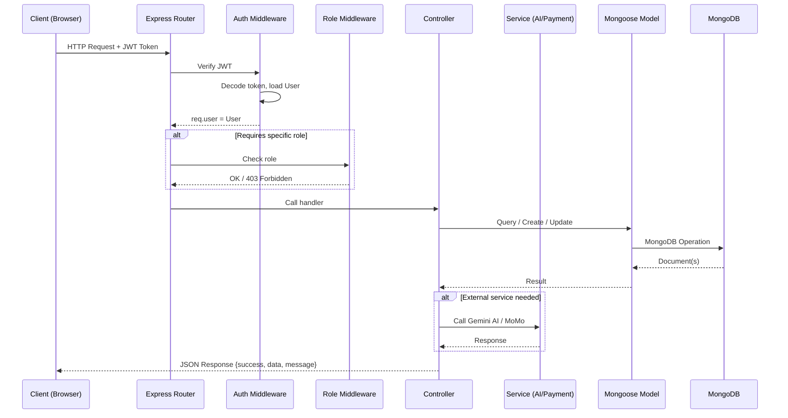

### 2.2.4 Bảng ánh xạ MVC

| View (Frontend) | Controller (Backend) | Model (Database) |
|-----------------|---------------------|------------------|
| `(auth)/login`, `(auth)/register` | `authController` (register, login, getMe) | `User` |
| `profile/` | `userController` (getProfile, updateProfile, changePassword) | `User` |
| `admin/users/` | `userController` (list, getById, updateById, deleteById) | `User` |
| `courses/` | `courseController` (list, getById, myCourses) | `Course`, `Enrollment` |
| `courses/[id]` | `courseController` (getById, create, update, remove) | `Course` |
| `courses/[id]/lesson/[lessonId]` | `lessonController` (listByCourse, getById, create, update, remove) | `Lesson` |
| `courses/[id]/exercise/[exerciseId]` | `exerciseController` + `submissionController` | `Exercise`, `Submission` |
| `courses/[id]/learn` | `enrollmentController` (enroll, updateProgress) | `Enrollment` |
| `payments/` | `paymentController` (create, confirm, myPayments) | `Payment` |
| `payments/return` | `paymentController` (momoIpn callback) | `Payment`, `Enrollment` |
| `admin/payments/` | `paymentController` (listAll) | `Payment` |
| `community/` | `postController` (list, getById, create, update, remove) | `Post`, `Comment` |
| `community/[id]` | `postController` + `commentController` | `Post`, `Comment` |
| `chatbot/` | `chatbotController` (chat, getHistory) | `ChatbotLog` |
| `admin/` | `adminController` (stats, charts) | Aggregation trên tất cả collections |
| `dashboard/` | `enrollmentController` (listByUser) + `submissionController` | `Enrollment`, `Submission` |

---

## Phụ lục: Tổng hợp API Endpoints

| Method | Endpoint | Mô tả | Auth | Role |
|--------|----------|-------|------|------|
| `POST` | `/api/auth/register` | Đăng ký | ❌ | – |
| `POST` | `/api/auth/login` | Đăng nhập | ❌ | – |
| `GET` | `/api/auth/me` | Thông tin user hiện tại | ✅ | – |
| `GET` | `/api/users/profile` | Xem hồ sơ | ✅ | – |
| `PATCH` | `/api/users/profile` | Sửa hồ sơ | ✅ | – |
| `POST` | `/api/users/change-password` | Đổi mật khẩu | ✅ | – |
| `GET` | `/api/users` | Danh sách user | ✅ | Admin |
| `GET` | `/api/users/:id` | Chi tiết user | ✅ | Admin |
| `PATCH` | `/api/users/:id` | Sửa user | ✅ | Admin |
| `DELETE` | `/api/users/:id` | Xóa user | ✅ | Admin |
| `GET` | `/api/courses` | Danh sách khóa | ❌* | – |
| `GET` | `/api/courses/my` | Khóa của tôi | ✅ | – |
| `GET` | `/api/courses/:id` | Chi tiết khóa | ❌* | – |
| `POST` | `/api/courses` | Tạo khóa | ✅ | Instructor/Admin |
| `PATCH` | `/api/courses/:id` | Sửa khóa | ✅ | Instructor/Admin |
| `DELETE` | `/api/courses/:id` | Xóa khóa | ✅ | Instructor/Admin |
| `GET` | `/api/lessons/course/:courseId` | Danh sách bài học | ❌* | – |
| `GET` | `/api/lessons/:id` | Chi tiết bài học | ❌* | – |
| `POST` | `/api/lessons/course/:courseId` | Tạo bài học | ✅ | Instructor/Admin |
| `PATCH` | `/api/lessons/:id` | Sửa bài học | ✅ | Instructor/Admin |
| `DELETE` | `/api/lessons/:id` | Xóa bài học | ✅ | Instructor/Admin |
| `GET` | `/api/exercises/course/:courseId` | Danh sách bài tập | ❌* | – |
| `GET` | `/api/exercises/:id` | Chi tiết bài tập | ❌* | – |
| `POST` | `/api/exercises/course/:courseId` | Tạo bài tập | ✅ | Instructor/Admin |
| `PATCH` | `/api/exercises/:id` | Sửa bài tập | ✅ | Instructor/Admin |
| `DELETE` | `/api/exercises/:id` | Xóa bài tập | ✅ | Instructor/Admin |
| `GET` | `/api/enrollments` | Danh sách đăng ký | ✅ | Student/Admin |
| `POST` | `/api/enrollments/:courseId` | Đăng ký khóa | ✅ | Student/Admin |
| `GET` | `/api/enrollments/:courseId` | Enrollment của tôi | ✅ | Student/Admin |
| `PATCH` | `/api/enrollments/:courseId/progress` | Cập nhật tiến độ | ✅ | Student/Admin |
| `POST` | `/api/payments/course/:courseId` | Tạo thanh toán | ✅ | – |
| `POST` | `/api/payments/:id/confirm` | Xác nhận thanh toán | ✅ | – |
| `GET` | `/api/payments` | Lịch sử thanh toán | ✅ | – |
| `GET` | `/api/payments/:id` | Chi tiết thanh toán | ✅ | – |
| `GET` | `/api/payments/admin` | Tất cả giao dịch | ✅ | Admin |
| `POST` | `/api/payments/momo/ipn` | MoMo IPN callback | ❌ | – |
| `POST` | `/api/submissions/:exerciseId` | Nộp bài | ✅ | – |
| `GET` | `/api/submissions/exercise/:exerciseId/my` | Bài nộp của tôi | ✅ | – |
| `GET` | `/api/submissions/course/:courseId/my` | Bài nộp theo khóa | ✅ | – |
| `GET` | `/api/submissions/exercise/:exerciseId/all` | Tất cả bài nộp (bài tập) | ✅ | Instructor/Admin |
| `GET` | `/api/submissions/course/:courseId/all` | Tất cả bài nộp (khóa) | ✅ | Instructor/Admin |
| `GET` | `/api/posts` | Danh sách bài viết | ❌* | – |
| `GET` | `/api/posts/:id` | Chi tiết bài viết + comments | ❌* | – |
| `POST` | `/api/posts` | Tạo bài viết | ✅ | – |
| `PATCH` | `/api/posts/:id` | Sửa bài viết | ✅ | Owner/Admin |
| `DELETE` | `/api/posts/:id` | Xóa bài viết | ✅ | Owner/Admin |
| `GET` | `/api/comments/post/:postId` | Bình luận theo bài | ❌* | – |
| `POST` | `/api/comments/post/:postId` | Tạo bình luận | ✅ | – |
| `PATCH` | `/api/comments/:id` | Sửa bình luận | ✅ | Owner/Admin |
| `DELETE` | `/api/comments/:id` | Xóa bình luận | ✅ | Owner/Admin |
| `POST` | `/api/chatbot/chat` | Chat với AI | ❌* | – |
| `GET` | `/api/chatbot/history/:sessionId` | Lịch sử chat | ❌* | – |
| `GET` | `/api/admin/stats` | Thống kê tổng quan | ✅ | Admin |
| `GET` | `/api/admin/charts` | Biểu đồ phân tích | ✅ | Admin |
| `POST` | `/api/upload/thumbnail` | Upload ảnh thumbnail | ✅ | Instructor/Admin |

> ❌* = optionalAuth (hoạt động cả khi chưa đăng nhập, nhưng có thêm context nếu đã đăng nhập)

---

*Tài liệu được tạo tự động dựa trên phân tích mã nguồn dự án X-Tech.*
